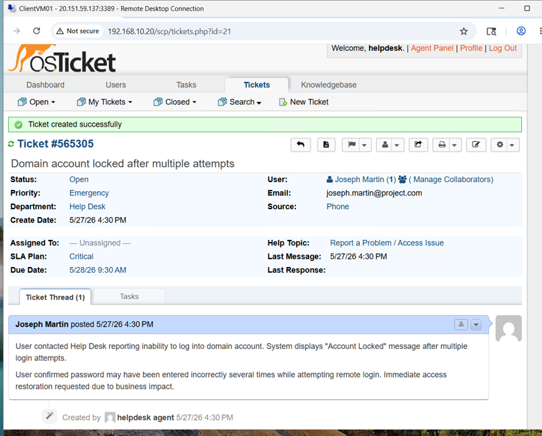
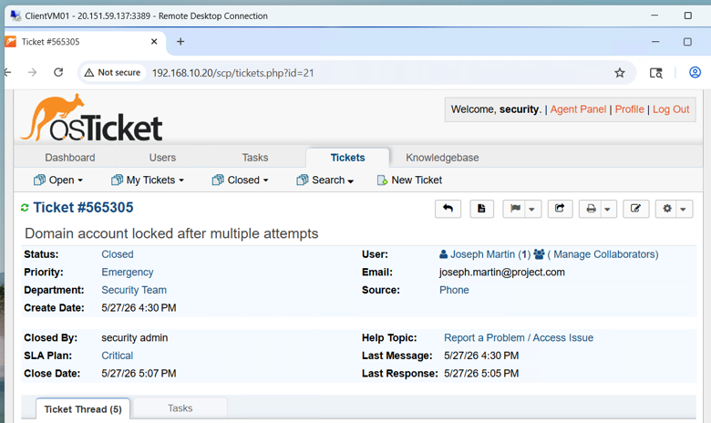

# Ticket Lifecycle Demonstration

This section demonstrates the complete lifecycle of a support ticket within the osTicket environment.

---

## Ticket Information

| Field | Value |
|---------|---------|
| Ticket Title | Domain Account Locked After Multiple Failed Login Attempts |
| Department | Help Desk |
| Priority | Emergency |
| Status | Closed |
| Created By | End User |
| Assigned To | IT Admin |

---

## User Reported Issue

The user reported that they were unable to log in to their workstation after multiple unsuccessful password attempts.

### Symptoms

- Login denied
- Account lockout message displayed
- Unable to access domain resources

### Ticket Created

The ticket was submitted through the osTicket user portal and automatically routed to the Help Desk department.

### Initial Assessment

The issue was reviewed by the IT Admin agent.

The reported symptoms indicated a possible Active Directory account lockout caused by repeated failed login attempts.

### Troubleshooting Performed

1. Verified user account status in Active Directory.
2. Confirmed account lockout condition.
3. Unlocked the user account.
4. Verified successful login.

PowerShell commands used: Unlock-ADAccount -Identity username
### Resolution

The user account was unlocked within Active Directory and login access was restored.

The user successfully authenticated and confirmed access to domain resources.

### Closure Notes

Issue resolved by unlocking the Active Directory account and verifying successful authentication.

Ticket status updated to Closed.

### Skills Demonstrated

- Ticket Lifecycle Management
- Active Directory Administration
- User Account Management
- IT Support Troubleshooting
- Incident Resolution
- Documentation

  ## Additional Test Tickets

The following tickets were created to validate ticket routing and department workflows:

- Password Reset Request
- Outlook Not Syncing
- Network Drive Access Issue
- VPN Connectivity Problem

These tickets were used to test department assignment, escalation workflows, and agent management within osTicket.
