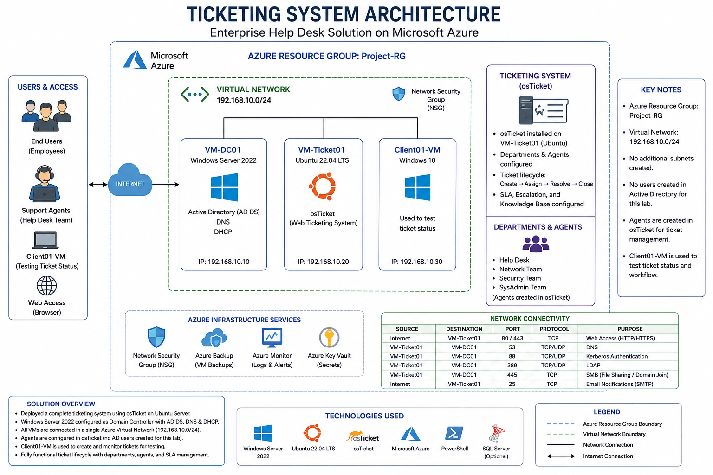

## Azure Enterprise Help Desk Ticketing System Lab

## Overview

This project demonstrates the deployment of an enterprise-style help desk environment in Microsoft Azure using Windows Server 2022, Ubuntu Linux, and osTicket.

## Enviornment

The environment simulates a real-world IT support infrastructure with ticket creation, assignment, escalation, and resolution workflows.

| Component | Purpose | IP Address |
|------------|-----------|-----------|
| VM-DC01 | Active Directory, DNS, DHCP | 192.168.10.10 |
| VM-Ticket01 | Ubuntu Server hosting osTicket | 192.168.10.20 |
| Client01-VM | Ticket testing workstation | DHCP |

## Architecture Diagram

## Technologies Used

- Microsoft Azure
- Windows Server 2022
- Active Directory Domain Services
- DNS
- DHCP
- Ubuntu Server 22.04
- Apache
- MariaDB
- PHP
- osTicket
- PowerShell

## Key Features

- Ticket lifecycle management
- Department-based ticket routing
- SLA configuration
- Agent management
- User ticket submission portal
- Administrative dashboard
- Windows and Linux administration

## Ticket Workflow

1. User submits ticket
2. Ticket enters Help Desk queue
3. Agent reviews ticket
4. Ticket assigned to appropriate department
5. Troubleshooting performed
6. Ticket resolved and closed

